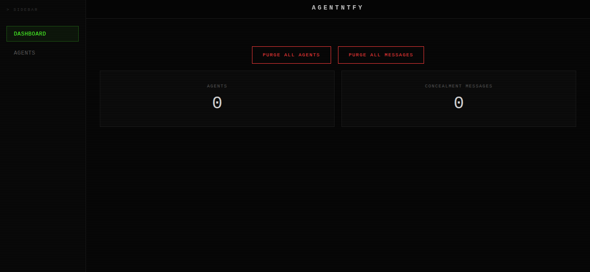

<div align="center"></div>

# AgentNTFY
Read a secure one-time message delivered with a Sci-Fi aesthetic.

# ⚙️ Installations
## Github
```
git clone https://github.com/firstdecree/agentntfy
```

## NpmJS
```
npm install
```

## PNPM
```
pnpm install
```

# 🛠️ Setup
## Web
Please open `example.config.toml`. All required configuration options are provided there, along with detailed comments explaining each setting.

1. First, deploy AgentNTFY to a hosting platform such as Vercel.
2. After deployment, add the hosted URL to `config.toml` under `web -> url`.
3. If you haven't already set your security useragent at `login -> userAgent` and set it as your browser useragent to access the panel.

# 🚀 Usage
After running, visit http://localhost:8080/
```
node index.js
```

<div align="center">
  <sub>This project is distributed under <a href="/LICENSE"><b>MIT License</b></a></sub>
</div>